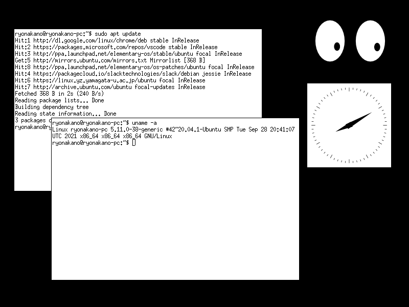

# tinywm-vala

A port of [TinyWM](https://github.com/mackstann/tinywm) written in Vala.

You'll need the following dependencies to build:

* libglib2.0-dev
* meson
* valac

Build & install with:

    meson build --prefix=/usr
    ninja -C build install

To test, exit the current X Window System (easily done by switching to another TTY) and run:

    echo "tinywm-vala & xterm" > ~/.xinitrc
    startx

(thanks to https://qiita.com/ai56go/items/dec1307f634181d923f5 for these instructions)
